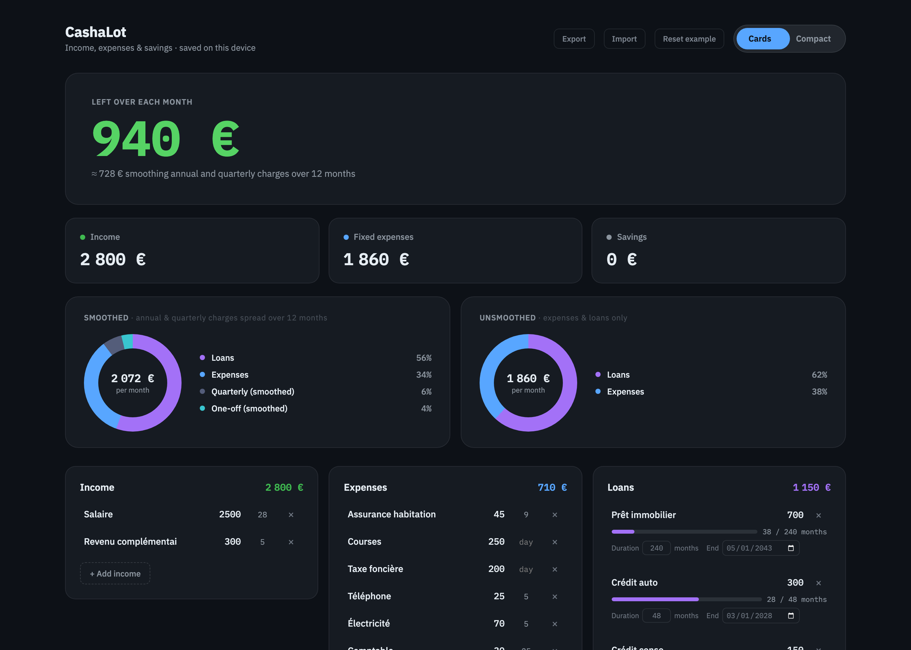

# Cashalot



Personal dashboard for tracking income, expenses, and savings — built to replace a spreadsheet. In-place editing (add/remove/edit rows), live calculations (money left over, smoothing of annual/quarterly charges), and two views (Cards / Compact) over the same data.

## Stack

No build dependency: Vue 3 (Composition API) loaded as an ES module, vendored locally in `vendor/`. The site is 100% static — `index.html` + `src/`.

## Run locally

```bash
npm install   # dev tools (lint, format) only — no runtime dependency
npm run dev   # serves the site at http://localhost:8080
```

Since `app.js` is an ES module, opening `index.html` directly via `file://` won't work: you need a server (`npm run dev`, or any other static server).

## Scripts

| Command                | Effect                              |
| ---------------------- | ----------------------------------- |
| `npm run dev`          | Serves the site locally             |
| `npm run lint`         | ESLint on `src/` and `scripts/`     |
| `npm run format`       | Formats with Prettier               |
| `npm run format:check` | Checks formatting without modifying |

## Structure

```
index.html          Structure + Vue template (Cards and Compact views)
src/
  app.js            Reactive state, calculations, persistence, animations
  style.css         Design tokens and styles
vendor/
  vue.esm-browser.prod.js   Vue 3, vendored (no network dependency at runtime)
scripts/
  dev-server.mjs    Small zero-dependency Node static server
.github/workflows/  CI (lint/format) + GitHub Pages deployment
```

## Data & privacy

All data (income, expenses, loans, savings...) lives **only in the browser's `localStorage`** — nothing is sent to a server, nothing is committed to the code. The example data seeded in `src/app.js` (`seedData`) is fictional.

`localStorage` is cleared if you clear your browsing data. Use the **Export** / **Import** buttons at the top of the dashboard to back up/restore your data as JSON.
